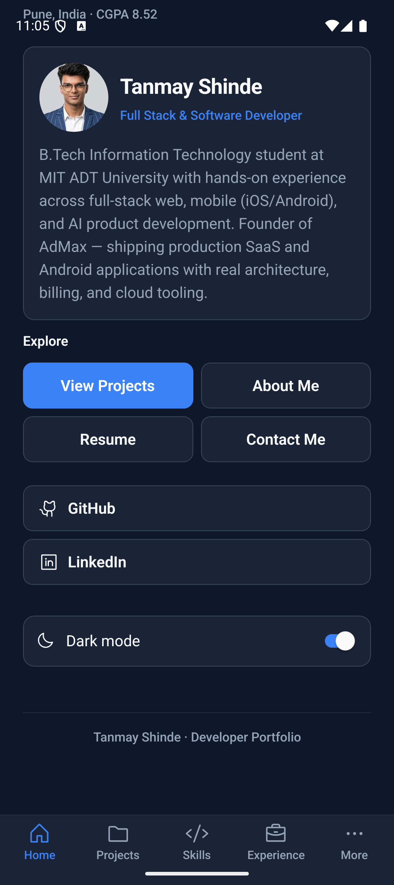
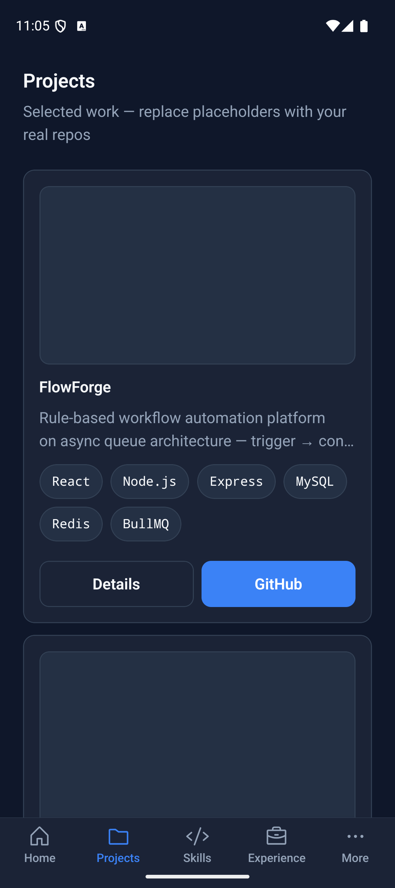
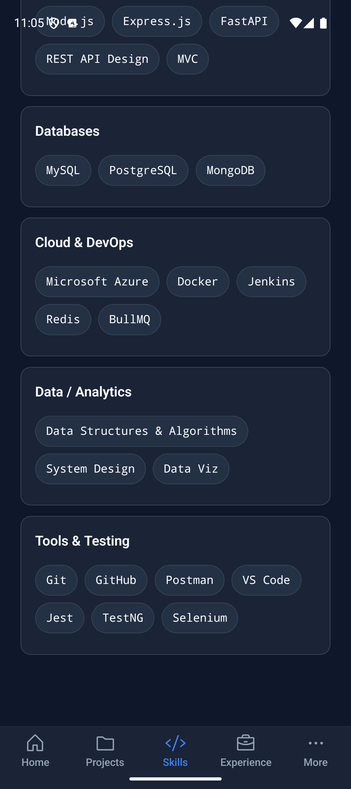

# TanmayPortfolio

**React Native** developer portfolio for [Tanmay Shinde](https://github.com/tanmays0) — TypeScript, Community CLI, Android-first.

A production-style mobile client: stack navigation, theme switching, JSON-backed project list, and a validated contact form. Built to read cleanly to recruiters and to run on a Pixel emulator in Android Studio.

<p align="center">
  
  &nbsp;
  
  &nbsp;
  
</p>

## Highlights

- **Stack navigation** across Home, About, Skills, Projects, Experience, Certifications, Resume, Contact
- **Projects** loaded from local JSON and rendered with `FlatList`
- **Dark / light theme** via `useState` + `Switch` and a shared theme context
- **Contact form** with controlled `TextInput`s, validation, and `onPress` submit
- **Flexbox layouts** for CTA wrap, skill chips, and experience timeline
- **TypeScript** + modular `src/` (components, screens, data, theme, navigation)

## Stack

| Layer | Choice |
| --- | --- |
| App | React Native `0.87` (Community CLI, not Expo) |
| Language | TypeScript |
| Navigation | React Navigation (native stack) |
| Icons | Phosphor |
| Platform demo | Android Studio · Pixel emulator |

## Quick start (Android)

```bash
npm install
npm start          # Metro
# other terminal
npm run android    # or open android/ in Android Studio → Run
```

If Metro cannot reach the device: `adb reverse tcp:8081 tcp:8081`

## Customize

Edit [`src/data/profile.ts`](src/data/profile.ts) for name, bio, links, and resume.

| Field | Value |
| --- | --- |
| GitHub | https://github.com/tanmays0 |
| LinkedIn | https://www.linkedin.com/in/tanmay-shinde-160a60282/ |
| Resume | Bundled at `assets/docs/Tanmay_Shinde_Resume.pdf` (or set `resumeUrl`) |

Project cards: [`src/data/projects.json`](src/data/projects.json) · skills / experience under [`src/data/`](src/data/).

## Structure

```
src/
  components/   reusable UI (Props)
  screens/      Home, About, Skills, Projects, Contact, …
  data/         profile, skills, projects.json, experience, certifications
  theme/        colors, tokens, typography, ThemeContext
  navigation/   stack navigator + types
android/        native Android project (open in Android Studio)
docs/           screenshots, coursework reports, presentation exports
```

## Coursework notes

University MAD deliverables (comparison report, folder structure, assignment mapping, screenshots) live under [`docs/`](docs/). They are not required to run the app.

## License

MIT — see [LICENSE](LICENSE).
